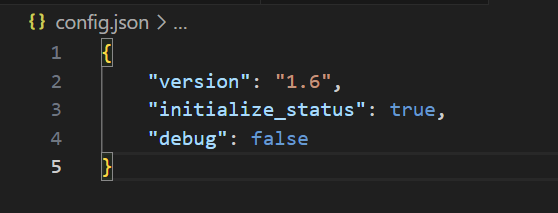
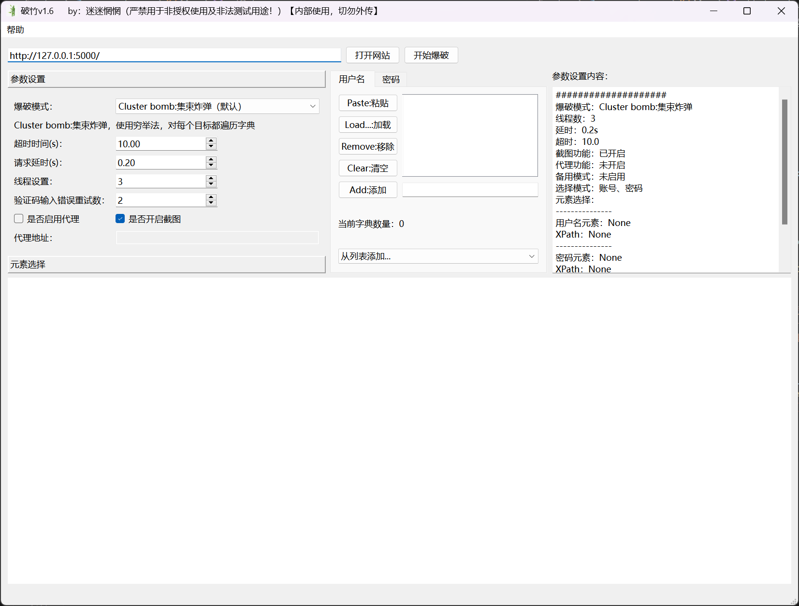
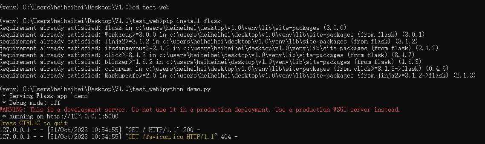
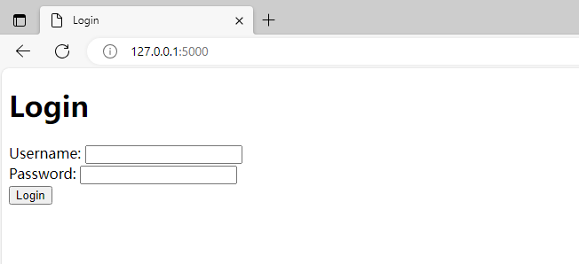
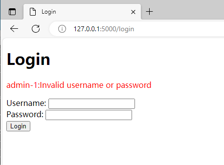
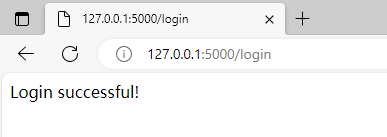
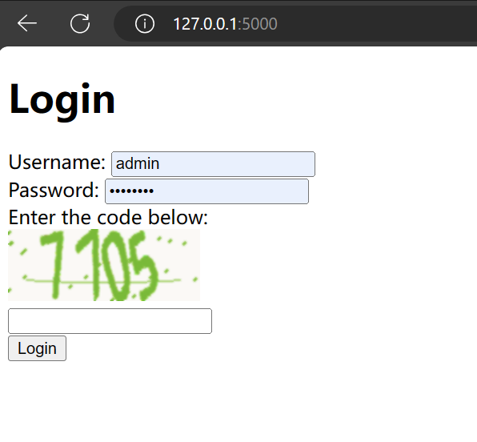

# 破竹【unstoppable Break Through】

> **目前版本：V1.6**

## 免责声明

　　请仔细阅读以下声明，否则请不要使用该工具，您的使用行为或者您以其他任何方式表示接受本协议的，即视为您已阅读并同意本协议的约束。

1. 本项目禁止用于未授权和非法测试
2. 该项目为作者学习selenium4和pyside6后的想法产出
3. 如您在使用本工具的过程中存在任何非法行为，您需自行承担相应后果，作者不承担任何法律及连带责任

## 牢记网络安全法

　　网络安全法普及：

　　第二十七条 **任何个人和组织**不得从事非法侵入他人网络、干扰他人网络正常功能、窃取网络数据等危害网络安全的活动；不得提供专门用于从事侵入网络、干扰网络正常功能及保护措施、窃取网络数据等危害网络安全活动的程序、工具；明知他人从事危害网络安全活动的，不得为其提供技术支持、广告推广、支付结算等帮助。

　　第六十三条 违反本法第二十七条规定，从事危害网络安全的活动，或者提供专门用于从事危害网络安全活动的程序、工具，或者为他人从事危害网络安全的活动提供技术支持、广告推广、支付结算等帮助，尚不构成犯罪的，由公安机关没收违法所得，处五日以下拘留，可以并处五万元以上五十万以下罚款；情节较重的，处五日以上十五日以下罚款。

　　单位有前款行为的，由公安机关没收违法所得，处十万元以上一百万以下罚款，并对直接负责的主管人员和其他直接责任人员依照前款规定处罚。

　　违反本法第二十七条规定，受到治安管理处罚的人员，五年内不得从事网络安全管理和网络运营关键岗位的工作；受到刑事处罚的人员，终身不得从事网络安全管理和网络运营关键岗位的工作。

## 项目介绍

　　该项目为了应对在测试时遇到采用前端加密发包的方式造成无法用burp进行爆破的情况而诞生，避免在**授权测试**过程中错过可能存在弱点的网站

　　该项目仅适用于**授权网站测试**中的：

* 仅密码登录
* 用户名或密码登录
* 用户名、密码、图片验证码登录

  该模式的图片验证码识别采用了ddddocr开源项目，经过测试发现较复杂的验证码识别错误率较高

  [sml2h3/ddddocr: 带带弟弟 通用验证码识别OCR pypi版 (github.com)](https://github.com/sml2h3/ddddocr)

## 目录结构

```
├─assets                      # README.md图片
├─demo                        # 测试web页面
├─Dict                        # 字典目录
├─Function                    # 逻辑方法文件夹
├─icon                        # 用到的icon
├─Server                      # 服务文件夹
│  └─browsermob-proxy-2.1.4             
├─UI                          # 各种UI文件
├─config.json                 # 默认配置文件
├─main.py                     # 主文件，运行即可启动
├─README.md
└─requirements.txt            # 依赖文件
```

## 必要运行环境（必看）

```
java1.8              --> 为browsermob-proxy提供环境，用来监控爆破流量
python3.8.10         --> 开发环境，未测试其他版本，建议版本为  3.8.1 <= python <= 3.9
chrome浏览器          --> 本项目基于chromedriver服务运行，必须安装
```

## 所需服务（必看）

```
browsermob-proxy-2.1.4外部库
开源地址：https://github.com/lightbody/browsermob-proxy
若不放心自带安装包，则可以前往官网下载，然后解压至Server文件夹中
安装证书(必要)：.\Server\browsermob-proxy-2.1.4\ssl-support\ca-certificate-rsa.cer
```

## 默认配置文件`config.json`​

　　​`version`​：当前版本号

　　​`initialize_status`​：初始化状态 --> 用于第一次加载main.py时自动匹配本机chrom，初始化版本相同的chromedrive文件

　　​`debug`​：是否启动debug模式

　　​​​​

## 运行

　　**推荐使用虚拟环境venv**

　　**创建虚拟环境：**​`python -m venv venv`​

　　**进入虚拟环境：**​`venv\Scripts\activate`​

　　**升级pip版本：**​`python -m pip install --upgrade pip`​

　　**安装依赖：**​`python -m pip install -r requirements.txt`​

　　**运行：**​`python main.py`​

　　​​​

## 使用步骤

```打开网站
打开网站 --> 设置参数 --> 点击指定元素选择 --> 鼠标点击指定元素（选中后右侧参数设置内容中会显示）--> 设置字典 --> 开始爆破
```

## 注意事项

1. **线程**设置默认为1-10可选，不建议太大，运行后加载服务的时间有点长
2. **延时**的意思是没爆破完一次后暂停多久
3. 如果**启用代理**，则必须设置代理地址，browsermob-proxy不会启用，可以和burp联动
4. 如果**未设置代理**，则默认启动browsermob-proxy监控爆破流量
5. 字典中的从**列表添加**，会默认加载所有Dict目录下的txt文件，可以自己选择

## 测试web页面

### demo.py

　　**要使用测试web，需要安装**​`flask`​库，然后运行`demo.py`​即可。

　　​​

　　页面简陋，仅用来测试，谅解

　　​​

　　登录后会显示登录的账号密码

　　​

　　默认账号密码为`admin/password`​

　　登录成功页面

　　​

### demo1.py

　　​`demo1.py`​带验证码，需要`captcha`​库，基本原理及账号密码同上

　　​​

## 案例测试

<video controls="controls" src="assets/20231107_161320-20231107164420-4g9767z.mp4" data-src="assets/20231107_161320-20231107164420-4g9767z.mp4"></video>


## 项目日志

　　2023-11-7：添加日志功能，添加备用功能，更新版本1.6

　　2023-11-6：添加icon，更新版本1.5

　　2023-11-5：命名为`破竹`​，取自势如破竹之意，英文名`uBt(unstoppableBreakThrough)`​，翻译为`不可阻挡的突破`​

　　2023-11-3：添加验证码识别功能，优化代码，UI重构，验证码失败重试

　　2023-11-2：修复部分bug，优化代码

　　2023-11-1：修复部分bug，优化代码

　　2023-10-31：V1.0完成（但还存在一些bug），编写该文档

　　2023-09：开始编写

　　2023-03：产生**通用web弱口令爆破工具**的想法

## TODO

* [ ] 字典加载大字典卡顿的问题
* [X] 加入日志功能
* [X] 验证码识别功能
* [X] 验证码识别失败重试
* [X] 验证码错误内容没显示
* [X] 参数设置中重试数不更新
* [X] 差一个icon

　　‍

　　‍
